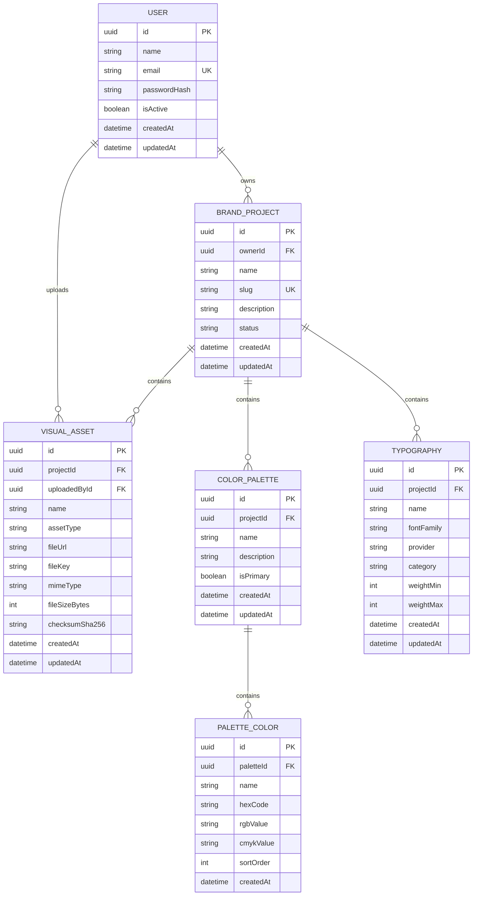

# 📐 Software Design Document (SDD) - Letzify

**Projeto:** Letzify (Gestão de Identidades Visuais)  
**Versão:** 1.0.0  
**Status:** 🟢 Pronto para Implementação  
**Stack Principal:** NestJS, Vue 3, Prisma ORM, PostgreSQL.

---

## 🏗️ 1. Arquitetura do Sistema (Estrutura Monorepo)

O projeto utiliza uma arquitetura de Monorepo. O Agente de IA deve respeitar a seguinte estrutura de pastas:

- **`apps/api`**: Servidor Backend (NestJS).
- **`apps/web`**: Aplicação Client (Vue 3 + TypeScript).

---

## 🤖 2. Orquestração e Ecossistema de Contexto (MCP)

> **Instrução para a IA:** Este projeto utiliza o Model Context Protocol (MCP) para garantir a paridade entre especificação e execução. Sempre utilize as ferramentas abaixo antes de propor alterações estruturais.

- **GitHub Projects MCP:** Utilize para sincronizar o status das User Stories (PRD) com o desenvolvimento técnico. As definições de "Done" devem seguir os Critérios de Aceitação das Issues.
- **Neon.tech MCP:** Interface obrigatória para introspecção e migração do banco de dados PostgreSQL. O esquema gerado pelo Prisma deve ser validado contra o estado real do banco via este MCP.

---

## 📦 3. Stack Tecnológica e Bibliotecas

> Definição estrita das tecnologias permitidas. Nenhuma dependência externa deve ser instalada sem refletir aqui.

### Core & Infraestrutura

- **Ambiente:** Node.js v20.x LTS.
- **Banco de Dados:** PostgreSQL 16 (Hospedado no Neon.tech).
- **Backend:** NestJS v10.x.
- **Frontend:** Vue 3 + TypeScript + Vite.
- **ORM:** Prisma v5.x (Interface oficial com o banco de dados).
- **Testes:** `jest` e `supertest` (Obrigatório seguir o padrão oficial do NestJS para testes unitários e E2E. Proibido o uso de Vitest, Mocha ou qualquer outro test runner no backend).

### Bibliotecas e Utilitários Permitidos

- **Auth:** Passport.js + JWT (`@nestjs/jwt` e `@nestjs/passport`) para sessões seguras.
- **Validação:** `class-validator` e `class-transformer` (Obrigatório para os Pipes globais de validação de DTOs).
- **Documentação:** `@nestjs/swagger` (OpenAPI 3.0 para os contratos de API).
- **Utilitários:** `date-fns` quando houver necessidade de controle temporal no domínio.

---

## 🗄️ 4. Arquitetura de Dados

### 📖 4.1. Glossário Técnico (Mapeamento)

| Termo PRD (PT-BR)            | Entidade Técnica (EN) | Atributos Principais                                    |
| :--------------------------- | :-------------------- | :------------------------------------------------------ |
| Usuário                      | `User`                | `id, name, email, passwordHash, isActive`               |
| Projeto de Identidade Visual | `BrandProject`        | `id, name, slug, description, status, ownerId`          |
| Paleta                       | `ColorPalette`        | `id, projectId, name, description, isPrimary`           |
| Cor da Paleta                | `PaletteColor`        | `id, paletteId, name, hexCode, rgbValue, cmykValue`     |
| Tipografia                   | `Typography`          | `id, projectId, name, fontFamily, category, provider`   |
| Asset Visual                 | `VisualAsset`         | `id, projectId, uploadedById, name, assetType, fileUrl` |

### 🗄️ 4.2. Modelagem de Dados (Dicionário de Entidades)

> **Instrução para a IA:** Utilize este diagrama Mermaid como fonte da verdade para gerar o arquivo `schema.prisma` e as migrações do banco de dados.



## 📑 5. Contratos Globais (DTOs & Interfaces)

> Tipagem TypeScript para validação de entrada (Request) e saída (Response).

- **LoginDto:** `{ email: string, password: string }` -> Retorna Token JWT + Perfil do Usuário.
- **CreateBrandProjectDto:** `{ name: string, description?: string }` -> Cria um novo projeto de identidade visual.
- **CreatePaletteDto:** `{ projectId: string, name: string, description?: string, isPrimary?: boolean }` -> Cria uma paleta vinculada ao projeto.
- **CreateTypographyDto:** `{ projectId: string, name: string, fontFamily: string, provider?: string, category?: string }` -> Cria a tipografia do projeto.
- **CreateVisualAssetDto:** `{ projectId: string, name: string, assetType: string, fileUrl: string, fileKey: string }` -> Registra um asset visual.

## 🏗️ 6. Scaffolding Macro (Arquitetura Backend)

### 📂 6.1. Estrutura de Diretórios (Padrão Oficial NestJS CLI)

> **Instrução para a IA:** Organize a pasta `apps/api/src` utilizando estritamente a arquitetura padrão gerada pelo NestJS CLI (Flat Structure). Cada domínio de negócio deve ser uma pasta direta na raiz do `src/`.

- **`src/auth/`**: Gestão de autenticação e autorização JWT.
- **`src/users/`**: Gestão de usuários e perfis.
- **`src/projects/`**: CRUD de projetos de identidade visual.
- **`src/palettes/`**: CRUD de paletas e cores associadas.
- **`src/typographies/`**: Gestão de tipografias por projeto.
- **`src/assets/`**: Upload e vínculo de assets visuais.
- **`src/common/`**: Código compartilhado globalmente (Decorators customizados, Guards de JWT, Filters de Exceção).
- **`src/prisma/`**: Módulo global contendo o `PrismaService` para injeção de dependência do banco de dados.

### 🧠 6.2. Core Services (Singleton)

| Service           | Responsabilidade Macro                                          |
| :---------------- | :-------------------------------------------------------------- |
| `PrismaService`   | Gerenciar conexão e pooling com o banco PostgreSQL (Neon.tech). |
| `AuthService`     | Validar credenciais e emitir Tokens de Acesso.                  |
| `ProjectsService` | Orquestrar CRUD e regras de negócio dos projetos.               |

## 🛡️ 7. Segurança (API Protection)

> Políticas de acesso e integridade dos dados no nível do servidor.

- **ValidationPipe:** Configurado com `whitelist: true` para ignorar campos não mapeados nos DTOs.
- **JWT Expiry:** Tokens de sessão com tempo configurável por ambiente.
- **CORS:** Restrito ao domínio do Frontend.
- **Autorização Inicial:** O controle de acesso será simples, baseado na autenticação do usuário e na posse do projeto. Perfis avançados de cliente, editor ou administrador ficam para evolução posterior.
- **Tratamento de Erros (Exception Filter):** A IA deve implementar um `GlobalExceptionFilter`. É estritamente proibido retornar erros em formatos arbitrários. Toda falha deve retornar ao Frontend neste exato formato JSON:
  ```json
  {
    "statusCode": 400,
    "timestamp": "2026-03-20T23:19:20.000Z",
    "path": "/api/rota",
    "message": "Descrição detalhada do erro ou array de validações"
  }
  ```

## 📡 8. Contratos de API (Especificação OpenAPI)

> **Instrução para a IA:** Implemente os Controllers e DTOs seguindo rigorosamente estas definições.

### 🔐 Módulo de Autenticação

- **POST** `/auth/login`
  - **Payload:** `{ "email": "string", "password": "string" }`
  - **Retorno:** `{ "accessToken": "string", "user": { "id", "name", "email" } }`

### 👥 Módulo de Usuários e Perfis

- **GET** `/users/me`
  - **Lógica:** Retorna o perfil do usuário autenticado.

### 📁 Módulo de Projetos

- **POST** `/projects`
  - **Payload:** `{ "name": "string", "description": "string" }`
- **GET** `/projects`
  - **Lógica:** Lista projetos visíveis ao usuário autenticado.
- **PATCH** `/projects/:id`
  - **Lógica:** Atualiza dados do projeto.
- **DELETE** `/projects/:id`
  - **Lógica:** Remove um projeto respeitando integridade referencial.

### 🎨 Módulo de Paletas

- **POST** `/projects/:id/palettes`
  - **Payload:** `{ "name": "string", "description": "string", "isPrimary": false }`
- **POST** `/palettes/:id/colors`
  - **Payload:** `{ "name": "string", "hexCode": "#FFFFFF", "rgbValue": "rgb(255,255,255)", "cmykValue": "cmyk(...)" }`

### 🔤 Módulo de Tipografias

- **POST** `/projects/:id/typographies`
  - **Payload:** `{ "name": "string", "fontFamily": "string", "provider": "string" }`

### 🖼️ Módulo de Assets

- **POST** `/projects/:id/assets`
  - **Payload:** `{ "name": "string", "assetType": "string", "fileUrl": "string", "fileKey": "string" }`

## ⚙️ 9. Contrato de Configuração (Environment)

> **Instrução Crítica para a IA:** Nenhum dado sensível ou configurável deve estar _hardcoded_. Utilize o `@nestjs/config` (`ConfigModule`) para carregar e validar as variáveis em tempo de inicialização.

As seguintes variáveis são o contrato obrigatório para o arquivo `.env`:

- `DATABASE_URL` = String de conexão do PostgreSQL (Neon.tech).
- `JWT_SECRET` = Chave para assinar o token de sessão do usuário.
- `JWT_EXPIRES_IN` = Tempo de expiração da sessão (ex: `8h`).
- `CORS_ORIGIN` = Origem permitida para o frontend Vue 3.
